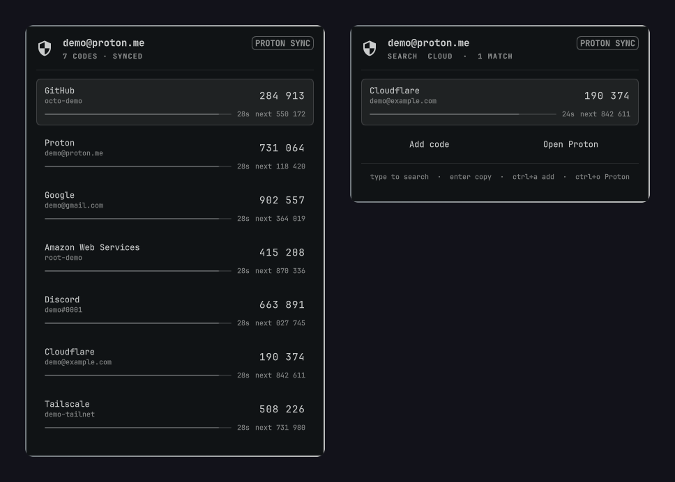
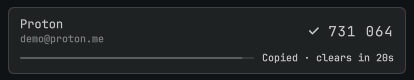

# Proton Authenticator for Omarchy

Your Proton Authenticator 2FA codes in the Omarchy bar. Type to search, press
Enter to copy. Codes sync with Proton Authenticator on your phone.



<sub>Screenshots use made-up demo accounts and codes.</sub>

> Independent community plugin. Not affiliated with or endorsed by Proton AG.
> “Proton” and “Proton Authenticator” name the service and the open-source app
> this plugin works with.

## Install

```bash
omarchy plugin add https://github.com/Zeus-Deus/proton-authenticator-omarchy-plugin.git --enable --yes
```

Or find it under Setup › Plugins. Then open the panel from the bar:

1. Press **Install secure helper**. Omarchy's floating terminal opens and
   builds the helper from Proton's official source through the AUR (a few
   minutes; you type your sudo password there, and it asks before replacing
   anything).
2. Press **Sign in with Proton**. Proton's own sign-in window opens: email,
   password, and your 2FA or security key, the same as on your phone.
3. Your codes appear. That's it.

Nothing is downloaded or built when the plugin itself is installed; the helper
is only installed when you press the button. See [Dependencies](#dependencies).

## Using it

| Key | Action |
|---|---|
| *just type* | Fuzzy search by service or account (`gh` finds GitHub) |
| `Enter` | Copy the highlighted code |
| `↑` `↓` / `Ctrl+J` `Ctrl+K` | Move the selection |
| `PgUp` `PgDn` / `Home` `End` | Jump through the list |
| `Backspace` / `Ctrl+U` | Edit / clear the search |
| `Esc` | Clear the search, then close the panel |
| `Ctrl+A` | Add a code (Proton's add window: manual entry or QR image) |
| `Ctrl+O` | Open Proton to edit, delete, reorder, import, export, or sign out |
| `Ctrl+R` | Refresh |
| `Ctrl+H` | Hide or show codes in this panel |
| `Ctrl+X` | Clear the helper's copy of every code (asks first) |
| `Tab` | Next bar panel |

Letters and digits only ever search; every action uses `Ctrl`, so typing a
name never opens a window. The mouse works too: click a row to copy it, and
the **Add code** and **Open Proton** buttons sit under the list.



Each row shows the current code, the next one, and the time left; the code
turns red in its last five seconds. A copied code is cleared from the clipboard
after 20 seconds and is marked sensitive, so Omarchy's clipboard history does
not keep it.

Adding, editing, and deleting codes happens in Proton's own window, so it
works exactly as on your phone and syncs to your other devices.

## Updates

The helper is an ordinary AUR package, so **`omarchy update` updates it** with
everything else. It switches to the new version by itself; your sign-in and
codes are kept. When Proton releases a new Authenticator version, the package
is rebuilt from Proton's new source and published.

## Dependencies

- Omarchy (Quattro shell) on Hyprland, with `wl-clipboard` (installed by
  default).
- A Proton account with Proton Authenticator.
- The helper package
  [`proton-authenticator-omarchy-helper`](https://aur.archlinux.org/packages/proton-authenticator-omarchy-helper)
  from the AUR. The panel installs it for you (step 1 above); by hand:
  `omarchy pkg aur add proton-authenticator-omarchy-helper`.

The helper replaces Proton's own Linux app (`proton-authenticator`) on the same
machine, because the two share one data folder and cannot run together. The
installer asks before removing it; your codes and sign-in are kept.

## How it works

Proton's Linux app has no command line or API, so no other program can read
codes from it. Rather than re-implement Proton's encryption in the shell, the
**helper is Proton's own app**, built from Proton's official source for the
release (`release/proton-authenticator@1.1.6`) with
[one patch](packaging/aur/omarchy-helper.patch) that:

- adds a private local socket the panel talks to (owner-only, and the helper
  checks the connecting user);
- runs the app hidden in the background as a hardened user service, and opens
  Proton's window on request (sign-in, add, manage);
- turns off the in-app updater, since updates come from the package;
- lets Hyprland float Proton's windows without a title bar.

Sign-in, keys, encryption, and sync are Proton's code, unchanged. The patched
tree is on the
[`omarchy-authenticator-helper`](https://github.com/Zeus-Deus/WebClients/tree/omarchy-authenticator-helper)
branch of a WebClients fork, and the package is built and checked from
[`packaging/aur/`](packaging/aur/).

## Security

- Your Proton password, 2FA, keys, and TOTP secrets never reach the panel.
  The panel receives only the rows it shows (service, account, current and next
  code), only while it is open, and forgets them when it closes.
- Copying sends the helper an item ID; the helper writes the clipboard itself
  and clears it after 20 seconds.
- The plugin makes no network connections of its own: no telemetry, analytics,
  or update check. The helper talks only to Proton, like Proton's own app.
- Proton's windows are hidden from screenshots and screen sharing, because they
  can show your secrets. To capture one on purpose:
  `omarchy-toggle proton-authenticator-screen-share on && hyprctl reload`,
  reopen the window, and turn it `off` again afterwards.
- Codes shown in the panel are ordinary pixels in the shell, so screenshots of
  the panel itself can capture them.
- The helper socket trusts your Unix user, not one program: anything running as
  you could ask it for codes, just as it could read Proton's own app data. It
  is not a defence against malware already running as your user.

Details: [SECURITY.md](SECURITY.md).

### For reviewers

The plugin runs these commands, all as fixed argv arrays with no shell in
between (except the installer terminal, whose command line is built from
constants only):

- `Service.qml`: `/usr/bin/python3 scripts/helper_client.py <op>` talks to the
  helper socket. `op` is one of `status`, `snapshot`, `copy`, `lock`, `open`,
  `probe`; the only variable arguments are a code's item ID (checked against
  `[A-Za-z0-9._:-]{1,128}`) and a window name from `login`, `add`, `manage`.
- `Service.qml`: `/usr/bin/systemctl --user enable --now` or `restart`
  `proton-authenticator-omarchy-helper.service`, from the panel's **Start
  helper** and **Restart helper** buttons.
- `Service.qml`: **Install secure helper** opens
  `omarchy-launch-floating-terminal-with-presentation scripts/setup-helper.sh`.
  That script runs in a terminal you can see: `omarchy-pkg-aur-add` to
  install, `yay -S --needed` to update, and `omarchy-pkg-drop` for Proton's own
  app only after a `gum confirm`. `sudo` is only ever typed by you in that
  terminal. The plugin itself never runs a package manager or `sudo`.
- `Service.qml`: **What gets installed?** opens this README's
  [How it works](#how-it-works) section with `omarchy-launch-browser`.

## Remove

```bash
systemctl --user disable --now proton-authenticator-omarchy-helper.service
omarchy pkg drop proton-authenticator-omarchy-helper
omarchy plugin remove io.github.zeus-deus.proton-authenticator
```

Removing the package leaves Proton's data folder
(`~/.local/share/me.proton.authenticator`) in place, so Proton's own app can
take over the same sign-in. Delete that folder to remove every local trace;
your codes stay on your Proton account. The plugin keeps no settings or data
of its own.

## Development

See [docs/DEVELOPMENT.md](docs/DEVELOPMENT.md) and [SECURITY.md](SECURITY.md).

## License

The plugin is [MIT](LICENSE). The helper package and its patch are GPL-3.0,
like Proton Authenticator. No Proton artwork or binaries are in this
repository.
